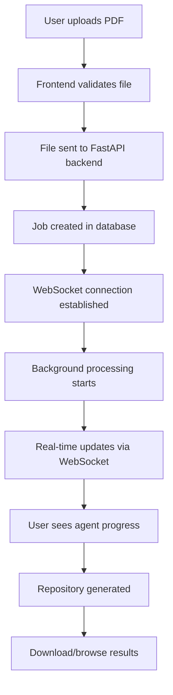
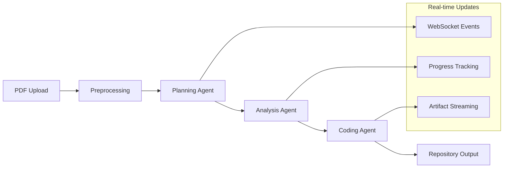

# PROJECT_STRUCTURE.md

## Paper2Code Web Application Architecture

### 🏗️ Overview
A modern web application that provides a **chat-like interface** for converting academic PDFs into code repositories using the existing Paper2Code multi-agent system.

---

## 📁 Proposed Directory Structure

```
Paper2Code/
├── 📂 frontend/                          # Next.js Web Application
│   ├── 📂 src/
│   │   ├── 📂 app/                       # Next.js App Router (v15)
│   │   │   ├── 📂 api/                   # API Routes (proxy to backend)
│   │   │   │   └── 📂 upload/
│   │   │   ├── 📂 chat/                  # Main chat interface
│   │   │   │   ├── page.tsx              # Chat UI with file upload
│   │   │   │   └── layout.tsx            # Chat layout with sidebars
│   │   │   ├── 📂 workflow/              # Agent workflow visualization
│   │   │   │   └── [jobId]/
│   │   │   │       └── page.tsx          # React Flow workflow view
│   │   │   ├── 📂 results/               # Generated repository browser
│   │   │   │   └── [jobId]/
│   │   │   │       └── page.tsx          # Code browser & download
│   │   │   ├── layout.tsx                # Root layout
│   │   │   ├── page.tsx                  # Landing/home page
│   │   │   └── globals.css               # Global styles
│   │   ├── 📂 components/                # Reusable UI components
│   │   │   ├── 📂 ui/                    # Shadcn/ui components
│   │   │   │   ├── button.tsx
│   │   │   │   ├── chat-input.tsx        # Custom chat input with file upload
│   │   │   │   ├── message.tsx           # Chat message component
│   │   │   │   ├── workflow-node.tsx     # Agent workflow nodes
│   │   │   │   ├── progress-bar.tsx      # Processing progress
│   │   │   │   └── file-viewer.tsx       # PDF/code file viewer
│   │   │   ├── 📂 chat/                  # Chat-specific components
│   │   │   │   ├── ChatInterface.tsx     # Main chat container
│   │   │   │   ├── MessageList.tsx       # Message history
│   │   │   │   ├── FileUploadZone.tsx    # Drag & drop upload
│   │   │   │   └── AgentStatusCard.tsx   # Current agent activity
│   │   │   ├── 📂 workflow/              # Workflow visualization
│   │   │   │   ├── WorkflowCanvas.tsx    # React Flow canvas
│   │   │   │   ├── PlanningNode.tsx      # Planning agent node
│   │   │   │   ├── AnalysisNode.tsx      # Analysis agent node
│   │   │   │   ├── CodingNode.tsx        # Coding agent node
│   │   │   │   └── ArtifactViewer.tsx    # Stage artifacts viewer
│   │   │   └── 📂 layout/                # Layout components
│   │   │       ├── Header.tsx            # App header with navigation
│   │   │       ├── Sidebar.tsx           # Job history sidebar
│   │   │       └── Footer.tsx            # App footer
│   │   ├── 📂 hooks/                     # Custom React hooks
│   │   │   ├── useWebSocket.ts           # WebSocket connection management
│   │   │   ├── useFileUpload.ts          # File upload logic
│   │   │   ├── useAgentStatus.ts         # Agent processing status
│   │   │   └── useJobHistory.ts          # Job tracking and history
│   │   ├── 📂 lib/                       # Utility libraries
│   │   │   ├── api.ts                    # API client functions
│   │   │   ├── websocket.ts              # WebSocket client
│   │   │   ├── utils.ts                  # General utilities
│   │   │   └── constants.ts              # App constants
│   │   ├── 📂 store/                     # Zustand state management
│   │   │   ├── chatStore.ts              # Chat messages & state
│   │   │   ├── jobStore.ts               # Processing jobs tracking
│   │   │   ├── uiStore.ts                # UI state (theme, modals)
│   │   │   └── index.ts                  # Store composition
│   │   └── 📂 types/                     # TypeScript type definitions
│   │       ├── chat.ts                   # Chat message types
│   │       ├── job.ts                    # Job processing types
│   │       ├── agent.ts                  # Agent status types
│   │       └── api.ts                    # API response types
│   ├── 📂 public/                        # Static assets
│   │   ├── favicon.ico
│   │   └── 📂 icons/                     # SVG icons and assets
│   ├── components.json                   # Shadcn/ui config
│   ├── next.config.js                    # Next.js configuration
│   ├── tailwind.config.js                # Tailwind CSS config
│   ├── tsconfig.json                     # TypeScript config
│   └── package.json                      # Frontend dependencies
│
├── 📂 backend/                           # FastAPI Web Server
│   ├── 📂 app/
│   │   ├── main.py                       # FastAPI app entry point
│   │   ├── 📂 api/                       # API route handlers
│   │   │   ├── __init__.py
│   │   │   ├── 📂 v1/                    # API version 1
│   │   │   │   ├── __init__.py
│   │   │   │   ├── upload.py             # File upload endpoints
│   │   │   │   ├── jobs.py               # Job management endpoints
│   │   │   │   ├── chat.py               # Chat message endpoints
│   │   │   │   └── websocket.py          # WebSocket connection handler
│   │   │   └── deps.py                   # API dependencies
│   │   ├── 📂 core/                      # Core application logic
│   │   │   ├── __init__.py
│   │   │   ├── config.py                 # App configuration
│   │   │   ├── security.py               # Authentication & security
│   │   │   └── database.py               # Database connection
│   │   ├── 📂 services/                  # Business logic services
│   │   │   ├── __init__.py
│   │   │   ├── paper_processor.py        # PDF processing orchestrator
│   │   │   ├── agent_manager.py          # Paper2Code agent coordination
│   │   │   ├── job_tracker.py            # Job progress tracking
│   │   │   ├── websocket_manager.py      # WebSocket connection management
│   │   │   └── file_manager.py           # File upload/storage management
│   │   ├── 📂 models/                    # Database models
│   │   │   ├── __init__.py
│   │   │   ├── job.py                    # Processing job model
│   │   │   ├── user.py                   # User session model
│   │   │   └── message.py                # Chat message model
│   │   ├── 📂 schemas/                   # Pydantic schemas
│   │   │   ├── __init__.py
│   │   │   ├── job.py                    # Job request/response schemas
│   │   │   ├── upload.py                 # File upload schemas
│   │   │   └── websocket.py              # WebSocket message schemas
│   │   └── 📂 integration/               # Paper2Code integration layer
│   │       ├── __init__.py
│   │       ├── paper_coder_wrapper.py    # Wrapper for existing scripts
│   │       ├── planning_agent.py         # Planning stage integration
│   │       ├── analysis_agent.py         # Analysis stage integration
│   │       └── coding_agent.py           # Coding stage integration
│   ├── 📂 migrations/                    # Database migrations
│   ├── requirements.txt                  # Python dependencies
│   └── Dockerfile                        # Docker configuration
│
├── 📂 shared/                            # Shared utilities & types
│   ├── 📂 types/                         # Shared TypeScript/Python types
│   │   ├── job-status.ts
│   │   └── agent-events.py
│   └── 📂 utils/                         # Cross-platform utilities
│
├── 📂 storage/                           # File storage (development)
│   ├── 📂 uploads/                       # Uploaded PDF files
│   ├── 📂 outputs/                       # Generated repositories (links to existing)
│   └── 📂 temp/                          # Temporary processing files
│
├── 📂 docs/                             # Project documentation
│   ├── 📂 api/                          # API documentation
│   └── 📂 deployment/                   # Deployment guides
│
# Existing directories (unchanged)
├── 📂 codes/                            # Original Paper2Code agents
├── 📂 data/                             # Benchmark datasets
├── 📂 examples/                         # Example papers and outputs
├── 📂 scripts/                          # Original shell scripts
└── 📂 assets/                           # Static assets
```

---

## 🔄 Application Flow Architecture

### **1. User Interaction Flow**


### **2. Agent Processing Pipeline**


### **3. WebSocket Communication Architecture**
```typescript
// WebSocket Event Types
interface WebSocketEvents {
  // Job events
  'job:started': { jobId: string, stage: 'preprocessing' }
  'job:stage_update': { jobId: string, stage: 'planning' | 'analysis' | 'coding', progress: number }
  'job:artifact': { jobId: string, stage: string, artifact: any }
  'job:completed': { jobId: string, repositoryPath: string }
  'job:error': { jobId: string, error: string }
  
  // Chat events  
  'chat:message': { message: string, type: 'user' | 'agent' | 'system' }
  'chat:typing': { isTyping: boolean }
  
  // Agent events
  'agent:status': { agent: string, status: 'idle' | 'processing' | 'completed' }
  'agent:log': { agent: string, message: string }
}
```

---

## 🎨 Component Architecture

### **Frontend Component Hierarchy**
```
App Layout
├── Header (navigation, theme toggle)
├── Main Content
│   ├── Chat Interface
│   │   ├── Message List
│   │   │   ├── User Messages
│   │   │   ├── Agent Messages
│   │   │   └── System Messages
│   │   ├── File Upload Zone
│   │   └── Chat Input
│   ├── Workflow Visualization (React Flow)
│   │   ├── Planning Node
│   │   ├── Analysis Node
│   │   ├── Coding Node
│   │   └── Progress Connectors
│   └── Results Browser
│       ├── File Tree
│       ├── Code Viewer
│       └── Download Options
└── Sidebar (job history, settings)
```

### **Backend Service Architecture**
```
FastAPI Application
├── API Routes Layer
│   ├── Upload endpoints
│   ├── Job management
│   ├── WebSocket handlers
│   └── File serving
├── Business Logic Layer
│   ├── Paper Processor Service
│   ├── Agent Manager Service
│   ├── Job Tracker Service
│   └── WebSocket Manager
├── Integration Layer
│   ├── Paper2Code Wrapper
│   ├── Agent Coordinators
│   └── File System Interface
└── Data Layer
    ├── Database Models
    ├── File Storage
    └── Cache Management
```

---

## 🔗 Integration Strategy

### **Seamless Integration with Existing Codebase**

#### **1. Wrapper Pattern**
```python
# backend/app/integration/paper_coder_wrapper.py
class Paper2CodeWrapper:
    def __init__(self, websocket_manager):
        self.websocket_manager = websocket_manager
        
    async def process_paper(self, job_id: str, pdf_path: str):
        """Orchestrate the 3-stage Paper2Code pipeline with real-time updates"""
        
        # Stage 1: Planning
        await self.websocket_manager.send_update(job_id, "stage", "planning")
        planning_result = await self._run_planning_stage(pdf_path)
        
        # Stage 2: Analysis  
        await self.websocket_manager.send_update(job_id, "stage", "analysis")
        analysis_result = await self._run_analysis_stage(planning_result)
        
        # Stage 3: Coding
        await self.websocket_manager.send_update(job_id, "stage", "coding") 
        coding_result = await self._run_coding_stage(analysis_result)
        
        return coding_result
```

#### **2. Minimal Code Changes**
- **No modification** to existing `codes/` directory
- **Import existing modules** directly in FastAPI services
- **Add progress callbacks** to existing functions
- **Maintain backward compatibility** with shell scripts

#### **3. Progressive Enhancement Approach**
- **Phase 1**: Basic web UI calling existing scripts
- **Phase 2**: Real-time progress tracking
- **Phase 3**: Advanced visualization and interaction
- **Phase 4**: Performance optimizations

---

## 📊 Data Flow Architecture

### **File Upload & Processing Flow**
1. **Frontend**: User drags/selects PDF file
2. **Frontend**: File validation (type, size)
3. **Backend**: Multipart file upload to `/api/v1/upload`
4. **Backend**: File stored in temporary directory
5. **Backend**: Job created in database
6. **Backend**: WebSocket connection established for job updates
7. **Backend**: Background task triggers Paper2Code processing
8. **Backend**: Real-time progress updates sent via WebSocket
9. **Frontend**: User sees live processing status and artifacts
10. **Backend**: Generated repository stored and downloadable
11. **Frontend**: Results displayed with browse/download options

### **State Management Flow**
```typescript
// Frontend state architecture
interface AppState {
  // Chat state
  chat: {
    messages: Message[]
    isTyping: boolean
    currentUpload?: File
  }
  
  // Job tracking state
  jobs: {
    active: Job[]
    history: Job[] 
    current?: string
  }
  
  // UI state
  ui: {
    theme: 'light' | 'dark'
    activeView: 'chat' | 'workflow' | 'results'
    sidebarOpen: boolean
  }
  
  // WebSocket connection state
  connection: {
    status: 'connected' | 'disconnected' | 'connecting'
    jobId?: string
  }
}
```

---

## 🚀 Deployment Architecture

### **Development Environment**
- **Frontend**: Next.js dev server (localhost:3000)
- **Backend**: FastAPI with uvicorn (localhost:8000)  
- **Database**: SQLite (local file)
- **Storage**: Local filesystem
- **WebSocket**: Direct connection

### **Production Environment Options**

#### **Option 1: Containerized Deployment**
```dockerfile
# Multi-stage Docker setup
FROM node:18-alpine AS frontend-builder
# Build Next.js application

FROM python:3.11-slim AS backend
# FastAPI application with existing Paper2Code code

FROM nginx:alpine AS proxy
# Reverse proxy for frontend/backend routing
```

#### **Option 2: Serverless + Traditional Backend**
- **Frontend**: Vercel (Next.js)
- **Backend**: Railway/Render (FastAPI)
- **Database**: PostgreSQL (managed)
- **Storage**: AWS S3/Google Cloud
- **WebSocket**: Backend-hosted

#### **Option 3: Full Cloud Native**
- **Frontend**: Vercel/Netlify
- **Backend**: Google Cloud Run / AWS ECS
- **Database**: Cloud SQL / RDS
- **Storage**: Cloud Storage
- **WebSocket**: Cloud-managed

---

## 🔒 Security Considerations

### **File Upload Security**
- File type validation (PDF only)
- File size limits (max 50MB)
- Virus scanning integration
- Temporary file cleanup

### **API Security**
- Rate limiting on uploads
- Input validation and sanitization
- CORS configuration
- Request size limits

### **WebSocket Security**
- Connection authentication
- Message validation
- Rate limiting on events
- Auto-disconnect on inactivity

### **Data Privacy**
- Uploaded PDFs deleted after processing
- No permanent storage of research papers
- Optional user session management
- GDPR compliance ready

---

## 📈 Scalability Considerations

### **Horizontal Scaling**
- **Frontend**: CDN + multiple Next.js instances
- **Backend**: Load-balanced FastAPI instances
- **Processing**: Queue-based job distribution
- **WebSocket**: Redis pub/sub for multi-instance support

### **Performance Optimization**
- **Frontend**: Code splitting, image optimization, caching
- **Backend**: Database connection pooling, response caching
- **File Processing**: Chunked uploads, progress streaming
- **Agent Processing**: Parallel execution where possible

### **Resource Management**
- **Memory**: Efficient PDF processing with streaming
- **CPU**: Background processing queue
- **Storage**: Automatic cleanup of temporary files
- **Network**: WebSocket connection pooling